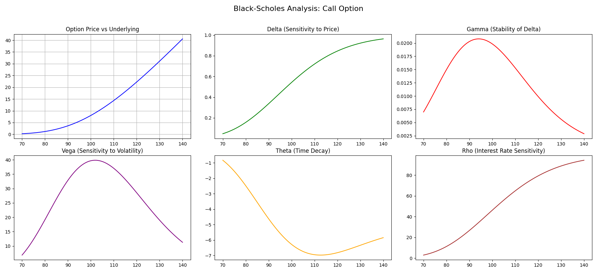

# Black-Scholes Option Pricing

A Python implementation of the Black-Scholes-Merton (BSM) Model used for pricing European-style options and calculating their sensitivities (The Greeks). This is designed for quantitative analysis, utilizing vectorized operations to allow for rapid sensitivity testing across varying market conditions.

The project is under the following assumptions for simplicity:
*  No dividends are paid with the underlying asset.
*  Markets are random (Brownian Motion is used for the movement of each asset).
*  No transaction costs or taxes.
*  Risk-free rate and volatility are always constant.
*  Returns are log-normally distributed.
*  European exercise style (no early execution).

## 1. Methematical Formulation
The Black-Scholes model assumes that the price of the underlying asset follows a Geometric Brownian Motion (GBM). The analytical solutions for the price of a European call ($C$) and put ($P$) are:

**Pricing Formulas**

$$C = S_0 N(d_1) - K e^{-rT} N(d_2)$$

$$P = K e^{-rT} N(-d_2) - S_0 N(-d_1)$$

Where $d_1$ and $d_2$ are defined as:

$$d_1 = \frac{\ln(S_0 / K) + (r + \sigma^2 / 2)T}{\sigma \sqrt{T}}$$

$$d_2 = d_1 - \sigma \sqrt{T}$$

**Variables:**
* $S_0$: Current price of the underlying asset.
* $K$: Strike price of the option.
* $T$: Time to expiration (expressed in years).
* $r$: Risk-free interest rate (constant).
* $\sigma$: Volatility of the underlying asset's returns.
* $N(\cdot)$: The Cumulative Distribution Function (CDF) of the standard normal distribution.

## 2. The Greek (Risk Sensitivities)
The  pricing model provides full support for calculating the "Greeks," which represent the sensitivity of the option's price to various model inputs:
* Delta ($\Delta$): Measures the rate of change of the option price with respect to the underlying asset's price ($\frac{\partial V}{\partial S}$).
* Gamma ($\Gamma$): Measures the rate of change in Delta with respect to the underlying price ($\frac{\partial^2 V}{\partial S^2}$).
* Vega ($\nu$): Measures sensitivity to the volatility of the underlying asset ($\frac{\partial V}{\partial \sigma}$).
* Theta ($\Theta$): Measures the sensitivity of the option value to the passage of time ($\frac{\partial V}{\partial T}$), also known as "time decay."
* Rho ($\rho$): Measures sensitivity to the risk-free interest rate ($\frac{\partial V}{\partial r}$).

## 3. Technical Implementation & Stack
**Techniques**
* **Object-Oriented Programming (OOP)**: The model is encapsulated in a BlackScholesModel class (see details in the py file).
* **Vectorization**: Using `NumPy` allows the model to compute prices and Greeks for large arrays of underlying prices simultaneously, which is significantly faster than standard Python loops.
* **Scientific Stack**: Applied `SciPy` statistical libraries for Cumulative Distribution Function (CDF) and Probability Density Function (PDF) calculations.
* **Visualization**: A comprehensive 6-panel dashboard is generated using `Matplotlib` to visualize the relationship between the underlying price and all five Greeks.

**Required Packages**
* `NumPy`: For numerical computations and array handling.
* `SciPy`: Specifically scipy.stats for normal distribution probability functions.
* `Matplotlib`: For generating analytical charts and performance dashboards.

## 4. Example Analysis
Assume there is an example with underlying asset price of $100, striker price is $105, expiration is in 1 year, risk-free rate is 0.05 and the volatility is 0.2, and the option is a call option. The following is the Black-Schole Analysis for this example call option

